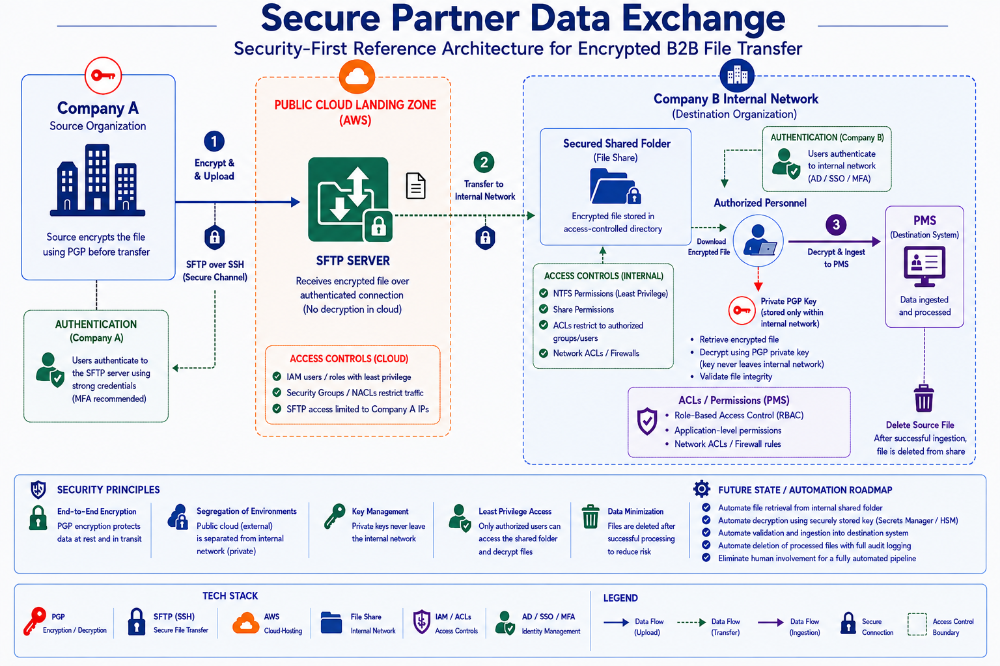

# 👋 Hi, I'm Josias! 
 
👨‍💻 IT Systems Manager building toward Network, Cloud & Security Architecture, grounded in real-world infrastructure, compliance, and risk reduction\
🏨 Running 24/7 IT operations across three resort properties for Marriott International, covering networks, vendors, compliance, and everything in between\
🛡️ I own our Property Security Review, auditing for PCI/PII and Marriott standards compliance, confirming what should be on our network, and flagging what shouldn't\
🔍 I also review vendor systems, verifying their technology stays on their network rather than ours, and understanding how it communicates, what data it handles, and how that data is protected\
🎓 Pursuing a B.S. in Cloud & Network Engineering (AWS Track) at Western Governors University\
🔧 Comfortable across TCP/IP, VPNs, network segmentation, Azure, Active Directory, and Python for automation\
📌 Focused on growing into Network & Cloud Architecture, Security Architecture, and IAM, building systems that hold up under pressure
 
Please explore my labs and projects below, and feel free to connect with me on
[LinkedIn](https://www.linkedin.com/in/josiasdelbois/) if you'd like to collaborate or learn more about my work!

## 💻 Tech Stack

#### Automation & Version Control:

#### Infrastructure & Enterprise Systems:

#### Security & Reliability:

#### Cloud, Integration & AI:

## ⚙️ Featured Projects

| Project | Preview |
|---|---|
| [Secure Partner Data Exchange](https://github.com/josiaslabs/secure-partner-data-exchange) |  |

## 🎓 Education

**Bachelor of Science – Cloud & Network Engineering (AWS Track)**  
*Western Governors University* | *Salt Lake City, UT* | *Expected 2027*

**Associate of Science – Business Management & Marketing**  
*Florida Technical College* | *Kissimmee, FL* | *May 2016*

## 📜 Certifications

  
  
  
  

